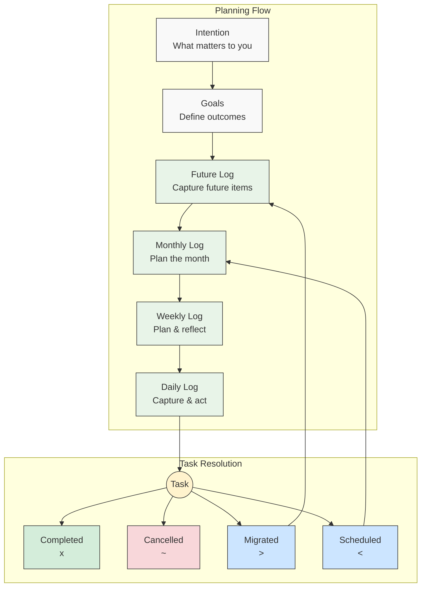
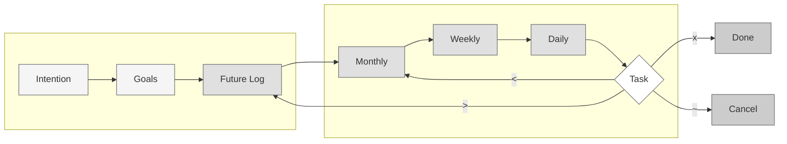

# Planning Flow Diagram

## Alternative: Compact "6" Shape

## Symbols Reference

| Symbol | Meaning |
|--------|---------|
| `.` | Task (incomplete) |
| `x` | Task (complete) |
| `>` | Task (migrated forward) |
| `<` | Task (scheduled to future) |
| `~` | Task (cancelled/irrelevant) |
| `-` | Note |
| `o` | Event |
| `=` | Mood / Feeling |
